# DexTrack: Dexterous Manipulation Tracking

[Website](https://meowuu7.github.io/DexTrack/)  | [Videos](https://youtu.be/zru1Z-DaiWE)  | [OpenReview](https://openreview.net/forum?id=ajSmXqgS24&noteId=SBH6txdWH9) | [arXiv](https://arxiv.org/abs/2502.09614)


Implementation of our work [DexTrack](https://meowuu7.github.io/DexTrack/), capable of serving as an effective tool to 1) create dexterous robot hand-object manipulation demonstrations by mimicking kinematic references, and 2) develop a versatile tracking controller that can accomplish diverse manipulation tasks.
<!-- .  Track 1) can serve as an effective tool to create dexterous robot hand-object manipulation demonstrations (with actions) and 2) is also a promising way to develop a tracking controller capable of accomplishing diverse manipulation tasks.  -->
 <!-- presenting an RL-based tracking control scheme for dexterous manipulations. It is a) an effective tool to create dexterous robot hand-object manipulation data with actions and b) a promising strategy to develop a generalizable and versatile neural controller for dexterous manipulation with a unified tracking scheme. -->

<!-- https://github.com/user-attachments/assets/1222fc51-42c9-4fd2-86cf-029b9c9c24ab  -->


https://github.com/user-attachments/assets/13ddaac9-7098-435d-8b52-7517e1e95419


<!-- 

DexTrack supports the following applications:
- Converting kinematic-only human-object manipulation trajectories into dynamics-aware robot hand action trajectories, enabling the robot to interact with the object while closely mimicking the corresponding kinematic states.

- Converting kinematic-only human-object manipulation trajectories to dynamics-aware dexterous robot hand action trajectories, driving the robot hand to interact with the object with the resulting states closely mimicking the corresponding kinematic references. 
- Developing a generalizable and versatile neural controller for dexterous manipulation. Unifiying manipulaton tasks into a general *tracking control* scheme and training to track abundant trajectories with diverse *tracking commands*, DexTrack can develop a tracking controller that can solve a wide range of manipulation tasks with nice generalization ability.  -->


## Getting Started

### Installation

Create a vritual environment with python 3.8.0:
```bash
conda create -n dextrack python=3.8.0
conda activate dextrack
```

Download the Isaac Gym Preview 4 release from the [website](https://developer.nvidia.com/isaac-gym). 
<!-- then -->
<!-- follow the installation instructions in the documentation. -->
```bash
cd isaacgym/python
pip install -e .
```

Install `torch_cluster`:
```bash
cd DexTrack/whls
pip install torch_cluster-1.6.3+pt24cu121-cp38-cp38-linux_x86_64.whl
```

Install other dependencies:
```bash
pip install rl_games transforms3d matplotlib omegaconf hydra-core trimesh mujoco tqdm
```

### Data

Download the retargeted data from [this link](https://1drv.ms/f/c/c746413ba7b58f04/EmTCrn1XSShNn34d3mTr7b4BBk1W4yqJxjY1y3WN0KRm3A?e=dxXnuT). Extract `.zip` files in the folder `isaacgymenvs/data`. 

Download the first part of object files from [this link](https://1drv.ms/u/c/c746413ba7b58f04/EVEQ8nNWsnROk5swNPIcqR8Bfq6eb716MFJTbkMneJEvew?e=1JbI7k). Extract this file in the folder `assets`. 

Download the second part of object files from [this link](https://1drv.ms/u/c/c746413ba7b58f04/Ed7YUar7_0lAvf9B8YQCZC0BEuaSr_5oSO65qR18RwBNvw?e=QC48Nn).  Extract this file in the folder `assets/rsc`. 

Download the third part of object files from [this link](https://1drv.ms/u/c/c746413ba7b58f04/EWEaowIuf7BMrL2NMSBXzM4BoXxjsc9HUp7wm36aLjdC5A?e=ccINfB).  Extract this file in the folder `assets`. 

(Optional) Download checkpoints from [this link](https://1drv.ms/u/c/c746413ba7b58f04/ERogbFMZSPZFs7tFY2Lz3iMBRbwt6PphW4qsqFDhhCTwuQ?e=O2Yep8). Extract it in the folder `isaacgymenvs/`. 

File structure:
```bash
isaacgymenvs/
  data/
    GRAB_Tracking_PK_reduced_300/
    GRAB_Tracking_PK_LEAP_OFFSET_0d4_0d5_warm_v2_v2urdf/
    modified_kinematics_data_leap_wfranka_v15urdf/
    TACO_Tracking_PK_reduced/
assets/
  datasetv4.1/
  meshdatav3_scaled/
  rsc/
    objs/
ckpts/
  ...
```

<!-- We've also included code for kinematic retargeting in this repo. Please refer to []() for detailed usage.  -->


## Usage

<!-- Dexterous Manipulation Tracking - Usage -->


This repository includes RL environments, along with the training and evaluation procedures, for the dexterous manipulation tracking problem.
 <!-- using a simulated fly Allegro hand (6 global translational and rotational DoFs).  -->
We support 1) a fly Allegro hand (an Allegro hand with 6 global translational and rotational DoFs) and 2) a LEAP hand mounted on a Franka Panda arm.
Two control strategies (action spaces) are implemented:
- Cumulated residual positional targets with kinematic bias; 
- Relative positional targets. 
The original implementation uses the first action space. 

 <!-- with a simulated fly Allegro hand (an Allegro hand with 6 global translational and rotational DoFs). We support two types of control strategies (action spaces):
- Cumulated residual positional targets with kinematics bias; 
- Relative positional targets. 
The original DexTrack's implementation uses the first action space.  -->

DexTrack include two levels of tracking: 
- **Single trajectory tracking:** The goal is to train a trajectory-specific policy to follow a single manipulation trajectory.
- **Multiple trajectories tracking:** The goal is to train a generalizable tracking policy capable of mimicking multiple manipulation trajectories and generalizing to unseen sequences.
<!-- for a generalizable and versatile tracker. The goal is training a single tracking policy that is able to track multiple manipulation trajectories, and has the ability to generalize to unobserved sequences.  -->
<!-- In the following, we will illustrate the training and evaluation processes for these two settings. -->
Below, we will outline the training and evaluation processes for both settings.

Please ensure that you are running these commands in the `DexTrack/isaacgymenvs` folder. 

### Sincle trajectory tracking (fly Allegro hand)

**GRAB Dataset**


To train a single trajectory tracker for a sequence retargeted from the **GRAB** dataset using the `cumulative residual` action space, run the following code:
```bash
bash scripts/run_tracking_headless_grab_single.sh <GPU_ID> <SEQ_NAME>
```
Please replace `<GPU_ID>` with the index of the GPU you wish to use. Only single-GPU training is supported. For other arguments, replace `<SEQ_NAME>` with the name of the sequence you wish to track. Checkpoints will be saved in the `./logs` folder.

<!-- Please replace `<GPU_ID>` with the index of the card you wish to run the code on. We only support single gpu training. Similarly, `<SEQ_NAME>` should be replaced by the name of the sequence you wish to track. Checkpoints will be saved in the folder `./logs`.  -->

Once you have obtained a checkpoint with a satisfactory reward, run the following code to evaluate it. A display is required if `HEADLESS` is set to `False`.
<!-- After you've obtained a checkpoint with a satisfactory reward, run the following code to evaluate it. You need a display if setting `HEADLESS` to `False`.  -->
<!-- Please note that the evaluation code is not running in a headless mode (you need a display). -->
```bash
bash scripts/run_tracking_headless_grab_single_test.sh <GPU_ID> <SEQ_NAME> <CKPT> <HEADLESS>
```

<!-- To train a single trajectory tracker for a sequence retargeted from the **GRAB** dataset using the `relative positional` action space, run the following code: -->
To train a single-trajectory tracker for a sequence retargeted from the **GRAB** dataset using the `relative positional` action space, run the following code:
```bash
bash scripts/run_tracking_headless_grab_single_ctlv2.sh <GPU_ID> <SEQ_NAME>
```
Similarly, after you've obtained a good checkpoint, run the following code to evaluate it. 
```bash
bash scripts/run_tracking_headless_grab_single_test_ctlv2.sh <GPU_ID> <SEQ_NAME> <CKPT> <HEADLESS>
```


<!-- For sequences retargeted from TACO dataset, to track a trajectory with tag `<TAG>` using the `cumulative residual` action space, run the following code:
```bash
bash scripts/run_tracking_headless_taco_single.sh <GPU_ID> <TAG>
```
Similarly, after you've obtained a satisfactory checkpoint, run the following code to evaluate it. 
```bash
bash scripts/run_tracking_headless_taco_single_test.sh <GPU_ID> <TAG> <CKPT>
``` -->


Below, we provide several examples. 

The following videos illustrate their corresponding input (kinematic references retargeted from human-object manipulation trajectories) and output (tracking results) that can be achieved. 

<!-- These are their input (kinematic references retargeted from human-object manipulation trajectories) and output (tracking results) that we can achieve.  -->


|   |    Cube       |       Duck          |     Flute        |      
| :----------------------: | :----------------------: | :---------------------: | :---------------------: | 
| Kinematic References  |     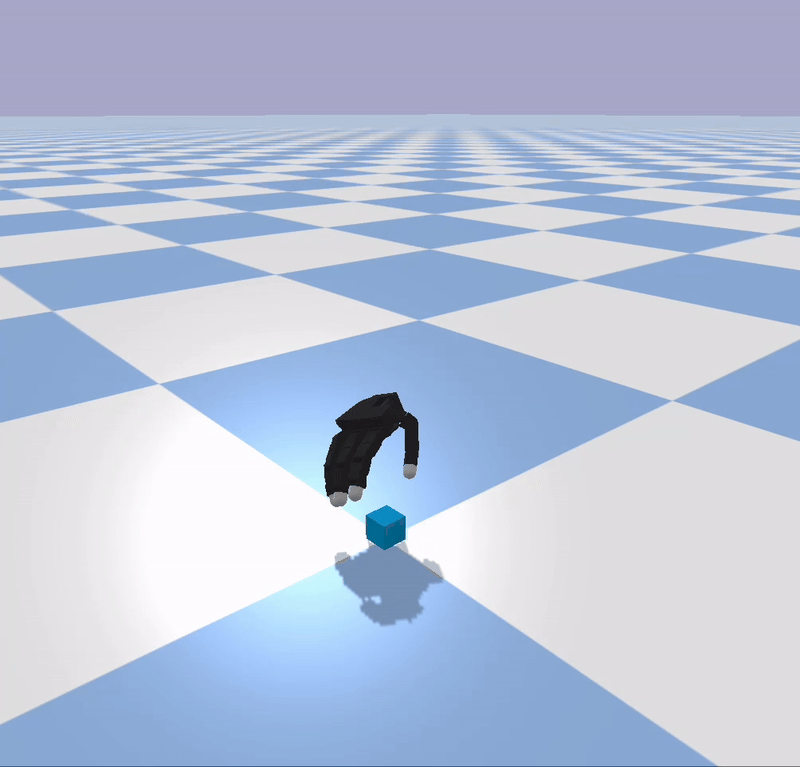        |       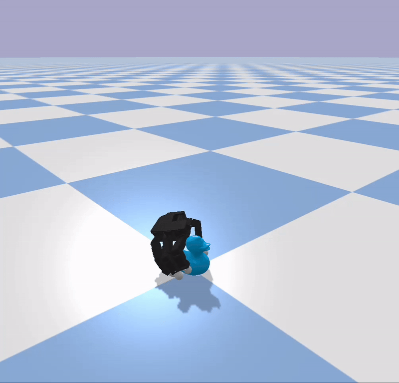         |      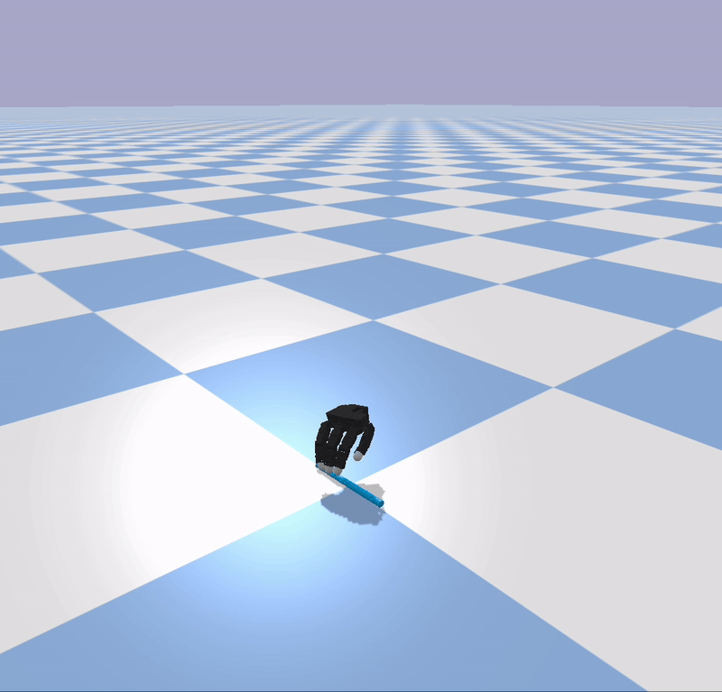         |   
| Tracking Result | 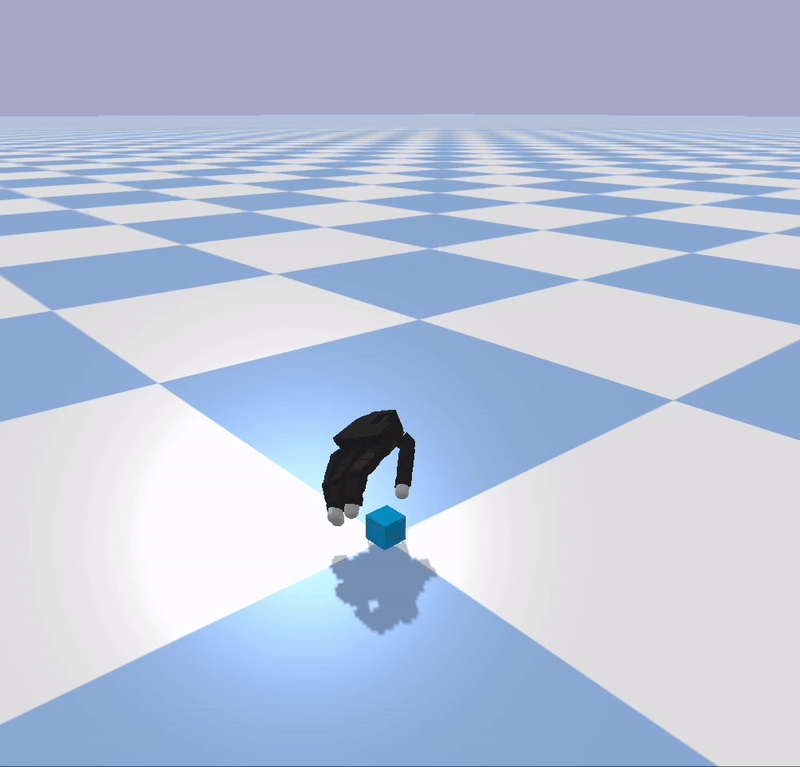 | 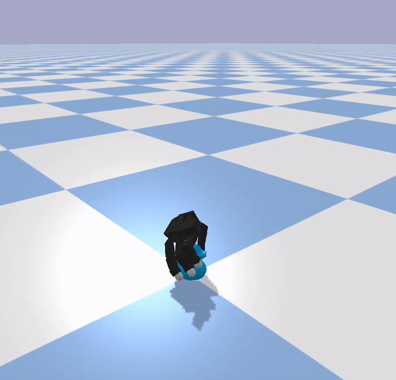 | 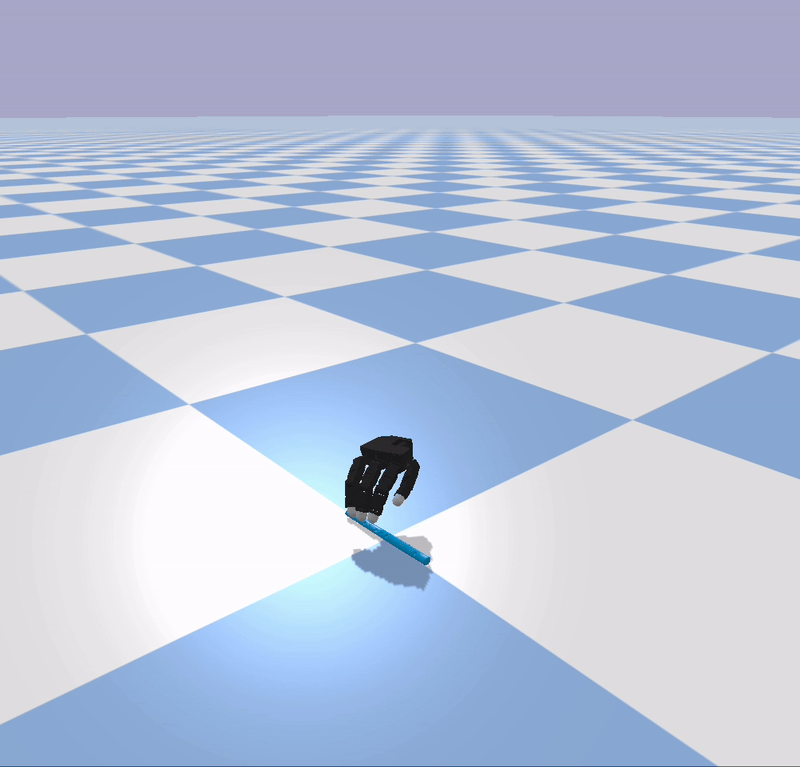 |

Please refer to the following instructions to reproduce the above tracking examples.


***Case 1: Cubesmall inspect***

To track the `cubesmall_inspect` trajectory from subject `s2` on `GPU 0`, whose corresponding sequence name is `ori_grab_s2_cubesmall_inspect_1`, please run:
```bash
bash scripts/run_tracking_headless_grab_single.sh 0 ori_grab_s2_cubesmall_inspect_1
```
This sequence can be tracked pretty well using quite short time. We can reach a reward more than `150` at epoch `50` using `22000` parallel environments. 

Our pre-trained weights can be downloaded form [](). Following instructions stated above and extract these files in the folder `./ckpts`, you can run the test code using our trained policy for this sequence using the following command:
```bash
bash scripts/run_tracking_headless_grab_single_test.sh 0 ori_grab_s2_cubesmall_inspect_1 ./ckpts/s2_cubesmall_inspect_ckpt.pth False 
```

***Case 2: Duck inspect***

To track the `duck_inspect` trajectory from subject `s2` on `GPU 0`, whose corresponding sequence name is `ori_grab_s2_duck_inspect_1`, please run:
```bash
bash scripts/run_tracking_headless_grab_single.sh 0 ori_grab_s2_duck_inspect_1
```
This sequence can also be tracked pretty well after training for a short time. We can reach a reward more than `150` at epoch `100` using `22000` parallel environments. 

Similarly, our pretrained policy for this sequence can be evaluated using the following command:
```bash
bash scripts/run_tracking_headless_grab_single_test.sh 0 ori_grab_s2_duck_inspect_1 ./ckpts/s2_duck_inspect_ckpt.pth False
```


***Case 3: Flute pass***

To track the `flute_pass` trajectory from subject `s2` on `GPU 0`, whose corresponding sequence name is `ori_grab_s2_flute_pass_1`, please run:
```bash
bash scripts/run_tracking_headless_grab_single.sh 0 ori_grab_s2_flute_pass_1
``` 
Our pretrained policy for this sequence can be evaluated using the following command:
```bash
bash scripts/run_tracking_headless_grab_single_test.sh 0 ori_grab_s2_flute_pass_1 ./ckpts/s2_flute_pass_ckpt.pth False
```


**TACO Dataset**

For sequences retargeted from **TACO** dataset, to track a trajectory with tag `<TAG>` using the `cumulative residual` action space, run the following code:
```bash
bash scripts/run_tracking_headless_taco_single.sh <GPU_ID> <TAG>
```
Similarly, after you've obtained a satisfactory checkpoint, run the following code to evaluate it. 
```bash
bash scripts/run_tracking_headless_taco_single_test.sh <GPU_ID> <TAG> <CKPT> <HEADLESS>
```


Below, we provide several examples. 

The following videos illustrate their corresponding input (kinematic references retargeted from human-object manipulation trajectories) and output (tracking results) that can be achieved. 

|   |    Shovel       |       Ladle         |     Soap        |      
| :----------------------: | :----------------------: | :---------------------: | :---------------------: | 
| Kinematic References  |     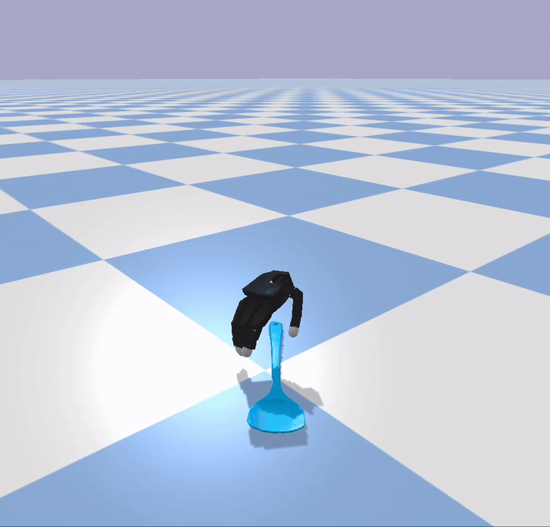        |       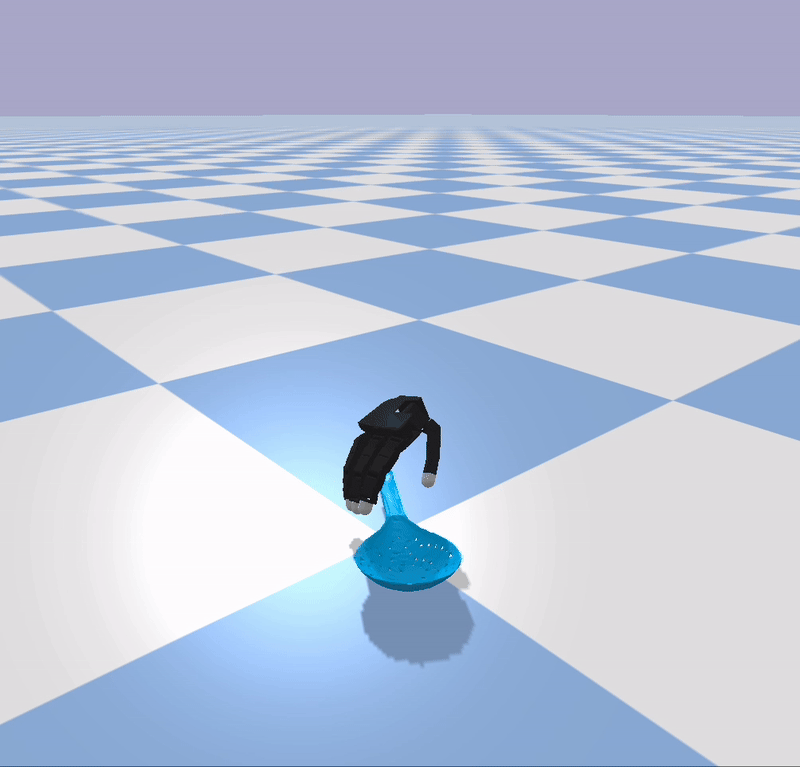         |      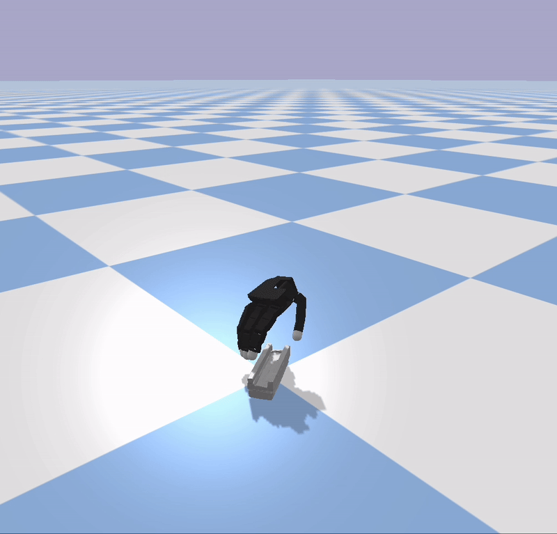         |   
| Tracking Result | 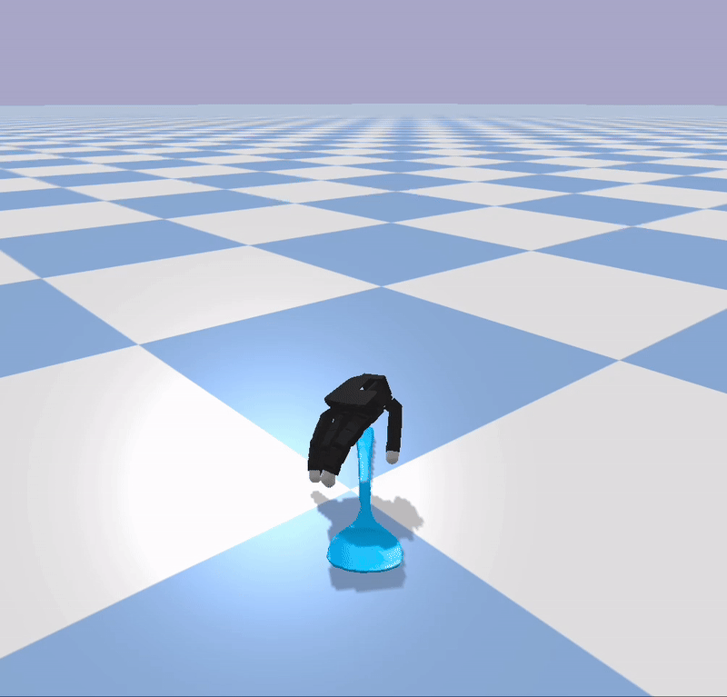 | 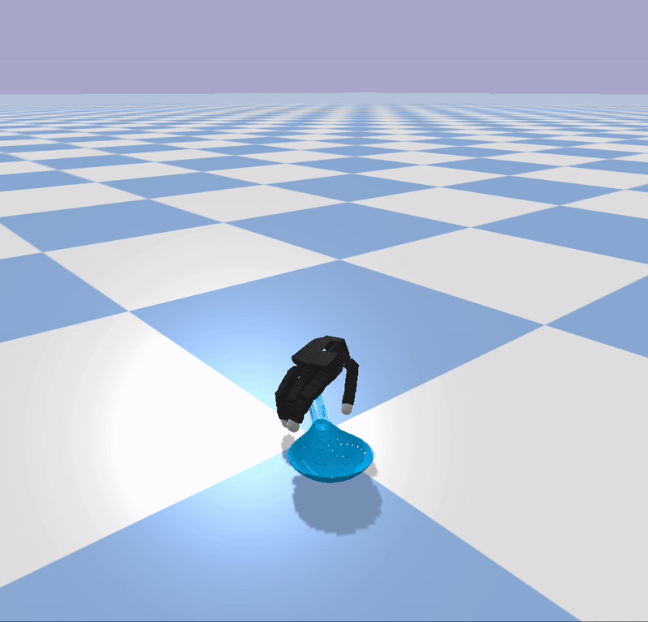 | 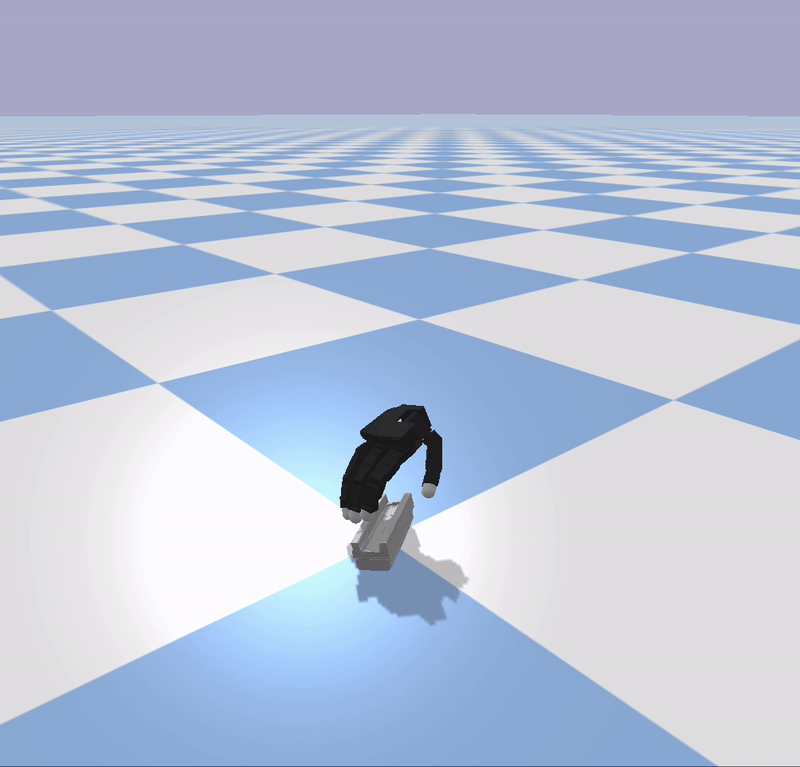 |


***Case 1: Tool-using sequence (shovel) from TACO***

To track the tool using sequence from TACO dataset tagged with `taco_20231104_169` on `GPU 0`, run the following code
```bash
bash scripts/run_tracking_headless_taco_single.sh 0 taco_20231104_169
```
In our test, we can get nice result after 300 epochs training. To evaluate our pretrained policy, run the following comamnd:
```bash
bash scripts/run_tracking_headless_taco_single_test.sh 0 taco_20231104_169 ./ckpts/taco_1_ckpt.pth False 
```


***Case 2: Tool-using sequence (ladle) from TACO***

To track the tool using sequence from TACO dataset tagged with `taco_20231104_186` on `GPU 0`, run the following code
```bash
bash scripts/run_tracking_headless_taco_single.sh 0 taco_20231104_186
```
To evaluate our pretrained policy, run the following comamnd:
```bash
bash scripts/run_tracking_headless_taco_single_test.sh 0 taco_20231104_186 ./ckpts/taco_2_ckpt.pth False
```


***Case 3: Tool-using sequence (soap) from TACO***

To track the tool using sequence from TACO dataset tagged with `taco_20231103_073` on `GPU 0`, run the following code
```bash
bash scripts/run_tracking_headless_taco_single.sh 0 taco_20231103_073
```
To evaluate our pretrained policy, run the following comamnd:
```bash
bash scripts/run_tracking_headless_taco_single_test.sh 0 taco_20231103_073 ./ckpts/taco_3_ckpt.pth False
```


### Multiple trajectory tracking (fly Allegro hand)

**GRAB Dataset**


To train a multiple trajectories tracker for sequences retargeted from the **GRAB** dataset using the `cumulative residual` action space, run the following code:
```bash
bash scripts/run_tracking_headless_grab_multiple.sh <GPU_ID> <SUBJ_NM> <SEQ_TAG_LIST>
```
Please replace `<GPU_ID>` with the index of the card you wish to run the code on. `<SEQ_TAG_LIST>` is the file specifying trajectories to track. 

For instance, to train a neural controller that can track all manipulation trajectories with the object `duck`, run the following command:
```bash
bash scripts/run_tracking_headless_grab_multiple.sh 0 '' ../assets/inst_tag_list_obj_duck.npy
```

For all trajectories in the GRAB's training split (trajectories from `s2` to `s10`), run:
```bash
bash scripts/run_tracking_headless_grab_multiple.sh 0 '' ''
```

<!-- Our pretrained checkpoint is `./ckpts/grab_duck_ckpt.pth`.  -->
The pretraiend policy for all trajectories in the GRAB's training split (trajectories from `s2` to `s10`) is `./ckpts/grab_trajs_tracking_ckpt.pth`. 
Run the following command to evaluate it (e.g. on the sequence `s2_duck_inspect_1`): 
```bash
bash scripts/run_tracking_headless_grab_multiple_test.sh 0 ori_grab_s2_duck_inspect_1 ./ckpts/grab_trajs_tracking_ckpt.pth False
```

<!-- The pretraiend policy for all trajectories in the GRAB's training split (trajectories from `s2` to `s10`) is `./ckpts/grab_trajs_tracking_ckpt.pth`.  -->


Similarly, to train a multiple trajectory tracker for a sequence retargeted from **GRAB** dataset using the `relative target` action space, run the following code:
```bash
bash scripts/run_tracking_headless_grab_multiple_ctlv2.sh <GPU_ID> <SUBJ_NM> <SEQ_TAG_LIST>
```
Running the following command for evaluation:
```bash
bash scripts/run_tracking_headless_grab_multiple_test_ctlv2.sh <GPU_ID> <TAG> <CKPT> <HEADLESS> 
```

### Single trajectory tracking (LEAP hand with Franka arm)


To train a tracking policy for a sequence retargeted from the **GRAB** dataset using the `relative positional` action space, run the following code:
```bash
bash scripts/run_tracking_headless_grab_single_wfranka.sh <GPU_ID> <TAG>
```
For testing: 
```bash
 bash scripts/run_tracking_headless_grab_single_wfranka_test.sh <GPU_ID> <TAG> <CKPT> <HEADLESS>
```

In additional to trajectories contained in the original GRAB dataset, we've synthesized more trajectories with in-hand reorientations. Please refer to `data/modified_kinematics_data_leap_wfranka_v15urdf` for their kinematic motions (the in-hand reorienntation stage contains only object motion variations with hand pose fixed). To train a tracking policy for a synthesized trajectory, run the following code:
```bash
bash scripts/run_tracking_headless_grab_single_syntraj_wfranka.sh <GPU_ID> <TAG> <SAMPLE_ID>
```
`<SAMPLE_ID>` should be replaced by a integer ranging from `0` to `99`. 
For test:
```bash
bash scripts/run_tracking_headless_grab_single_syntraj_wfranka.sh <GPU_ID> <TAG> <SAMPLE_ID> <CKPT> <HEADLESS>
```

Below, we give several examples. 

Their corresponding input and output are illustrated in the following videos: 

|   |    Elephant       |       Hammer         |     Watch        |      
| :----------------------: | :----------------------: | :---------------------: | :---------------------: | 
| Kinematic References  |             |                |      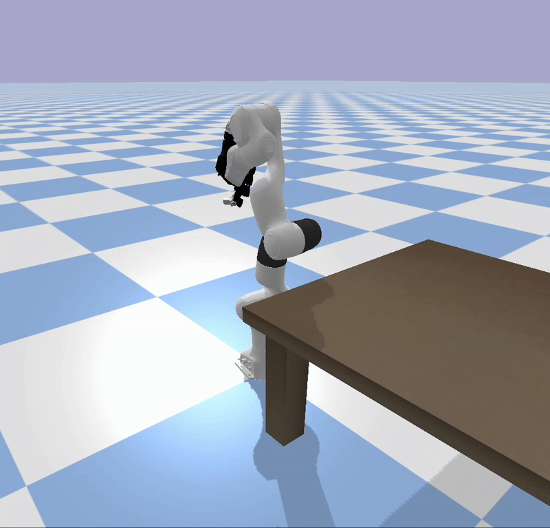         |   
| Tracking Result | 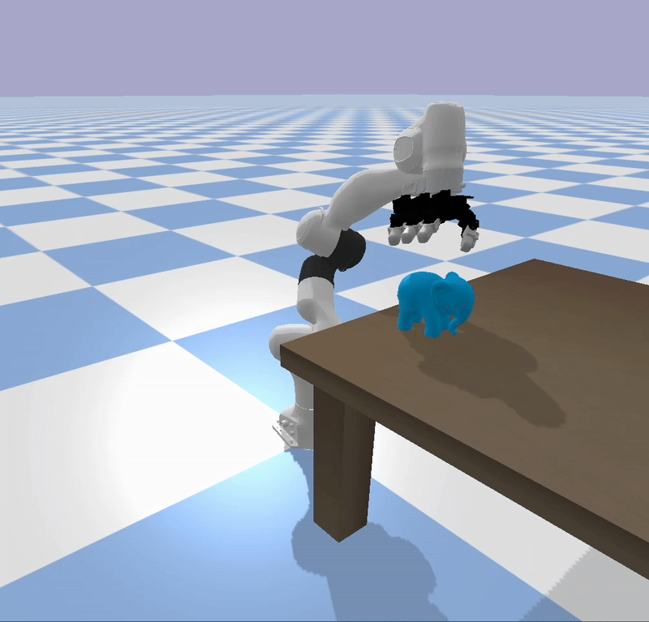 | 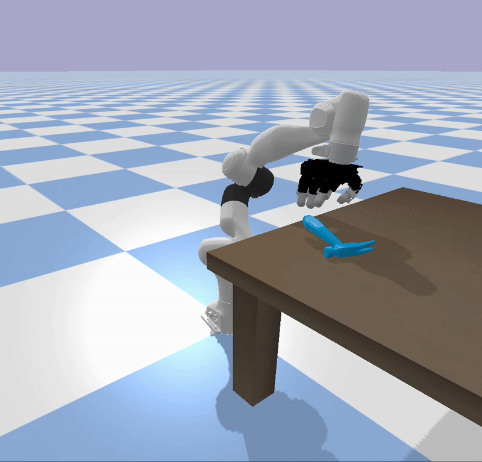 | 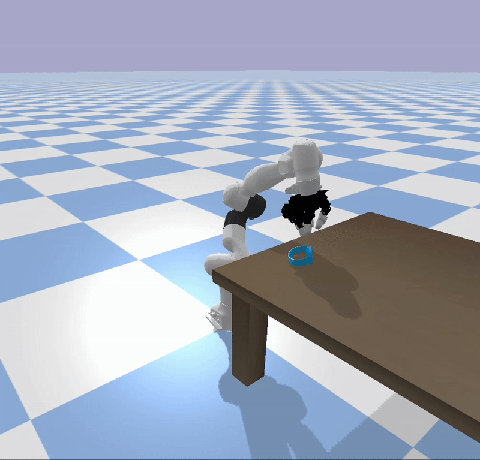 |


***Case 1: Elephant***

For training, run the following code
```bash
bash scripts/run_tracking_headless_grab_single_wfranka.sh 0 ori_grab_s2_elephant_inspect_1
```
To evaluate our pretrained policy, run the following comamnd:
```bash
bash scripts/run_tracking_headless_grab_single_wfranka_test.sh 0 ori_grab_s2_elephant_inspect_1 ./ckpts/elephant_inspect_wfranka_ckpt.pth False
```


***Case 2: Hammer***

For training, run the following code
```bash
bash scripts/run_tracking_headless_grab_single_syntraj_wfranka.sh 0 ori_grab_s2_hammer_use_2 6
```
To evaluate our pretrained policy, run the following comamnd:
```bash
bash scripts/run_tracking_headless_grab_single_syntraj_wfranka.sh 0 ori_grab_s2_hammer_use_2 6 ./ckpts/hammer_reorient_sample_6_ckpt.pth False
```


***Case 3: Watch***

For training, run the following code
```bash
bash scripts/run_tracking_headless_grab_single_wfranka.sh 0 s1_watch_set_2
```
To evaluate our pretrained policy, run the following comamnd:
```bash
bash scripts/run_tracking_headless_grab_single_wfranka_test.sh 0 ori_grab_s1_watch_set_2 ./ckpts/watch_set_ckpt.pth False 
```


### Multiple trajectories tracking (LEAP with Franka arm)

Similar to the fly hand setting, run the following command to train a tracking controller for sequences retargeted from the `GRAB` dataset:
```bash
bash scripts/run_tracking_headless_grab_multiple_wfranka.sh <GPU_ID> <SEQ_TAG_LIST>
```
For evaluation:
```bash
bash scripts/run_tracking_headless_grab_multiple_wfranka_test.sh <GPU_ID> <TAG> <CKPT> <HEADLESS>
```

We've included pre-trained checkpoints for `s2` `s4` and `s6` in the `./ckpts` folder (`leap_franka_grab_s${idx}_ckpt.pth`). 


**Notice**: In addition to the single and multiple trajectory tracking processes included above, DexTrack incorporates two key components that make the specialist-generalist iterative training framework work: 1) homotopy optimization for enhancing single trajectory tracking (applicable only to policies using the `cumulative residual` action space), and 2) a combination of IL and RL to improve the generalist tracker. However, these components require significant human effort and cannot easily be condensed into a single script. Besides, the corresponding code and scripts are too messy to be cleaned within an acceptable time frame. As a result, we do not currently plan to release them publicly.


## Contact

Please contact xymeow7@gmail.com or create a github issue if you have any questions.

<!-- ## Bibtex

If you find this code useful in your research, please cite: -->

<!-- ```bibtex
@inproceedings{liu2025,
   title={GeneOH Diffusion: Towards Generalizable Hand-Object Interaction Denoising via Denoising Diffusion},
   author={Liu, Xueyi and Yi, Li},
   booktitle={The Twelfth International Conference on Learning Representations},
   year={2024}
}
``` -->


## Acknowledgments

This code is standing on the shoulders of giants. We want to thank the following contributors that our code is based on: [IsaacGymEnvs](https://github.com/isaac-sim/IsaacGymEnvs/tree/main) and [UniDexGrasp](https://github.com/PKU-EPIC/UniDexGrasp). 


## License

See [LICENSE](LICENSE.txt).


<!-- you can run the test code using our trained policy for this sequence using the following command: -->


